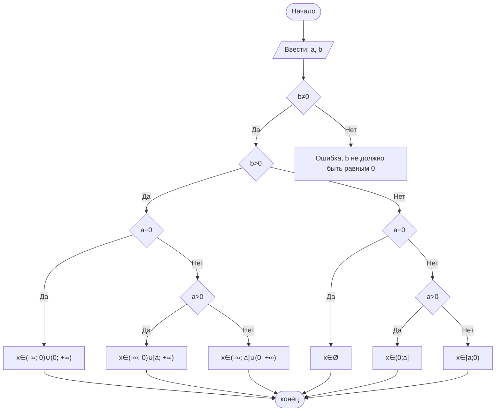

## Отчет по лабораторной работе № 1

#### № группы: `ПМ-2601`

#### Выполнил: `Бутко Елизавета Сергеевна`

#### Вариант: `1`

### Cодержание:

- [Постановка задачи](#1-постановка-задачи)
- [Входные и выходные данные](#2-входные-и-выходные-данные)
- [Выбор структуры данных](#3-выбор-структуры-данных)
- [Алгоритм](#4-алгоритм)
- [Программа](#5-программа)
- [Анализ правильности решения](#6-анализ-правильности-решения)

### 1. Постановка задачи
> Дано неравенство: (x − a)/b·x≥ 0, где a и b — параметры (вводятся с клавиатуры). Решите его для x.
> Программа получает на вход 2 числа a и b. Нужно решить неравенство относительно x.

### 2. Входные и выходные данные

#### Данные на вход

На вход программа должна получать 2 числа, при этом в условии не сказано, к какому множеству
принадлежать получаемые числа, поэтому будем считать их вещественными. Т.к числа a и b - вещественные, то диапазон этих чисел - диапазон допустимых значений типа double.

|             | Тип                |
|-------------|--------------------|
| a (Число 1) | Вещественное число |
| b (Число 2) | Вещественное число |

#### Данные на выход

Т.к. программа должна вывести решение неравенства, то на выход мы получим строку.

### 3. Выбор структуры данных

Программа получает 2 вещественных числа. Поэтому для их хранения
можно выделить 2 переменных (`a` и `b`) типа `double`.

|             | название переменной | Тип (в Java) | 
|-------------|---------------------|--------------|
| a (Число 1) | `a`                 | `double`     |
| b (Число 2) | `b`                 | `double`     | 

### 4. Алгоритм

1. Если b=0, выводим ошибку
2. Если b≠0, то определяем, нужно ли поменять знак неравенства:
   2.1 Если b>0, то знак остается прежним:
   2.1.1 Если a=0, то решение неравенства x≠0
   2.1.2 Если a>0, то решение неравенства x∈(-∞; 0)∪[a; +∞)
   2.1.3 Если a<0, то решение неравенства x∈(-∞; a]∪(0; +∞)
   2.2 Если b<0, то знак неравенства меняется на противоположный:
   2.2.1 Если a=0, то неравенство решения не имеет x∈Ø
   2.2.2 Если a>0, то решение x∈(0;a]
   2.2.3 Если a<0, то решение x∈[a;0)

#### Алгоритм выполнения программы:

1. **Ввод данных:**  
   Программа считывает два вещественных числа, обозначенные как `a` и `b`.

2. **Проверка на условие: b=0**
   Если b=0, то программа выводит строку: "b не может быть равным нулю"
3. **Знак b**
   По знаку b определяем, нужно ли поменять знак неравенства
4. **Рассматриваем случаи a=0, a>0, a<0**
   Решаем неравенство со значением параметра a, где x=0 - выколотая точка
5. **Вывод**
   Строка с решением или строка об отсутствие решения
   

#### Блок-схема



### 5. Программа

```java

```

### 6. Анализ правильности решения


        1000000000
        ```
